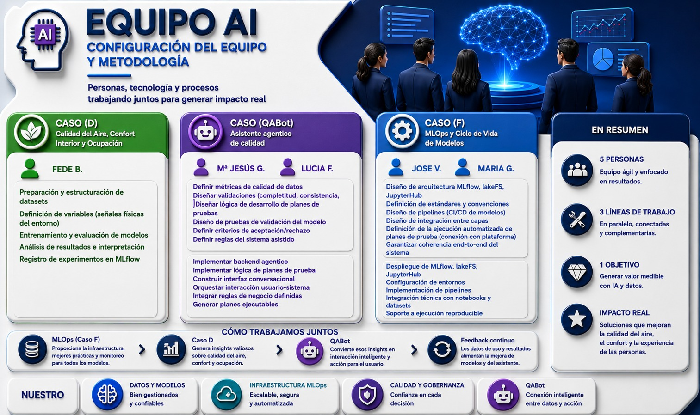

# simarro-ia-project

Proyecto integrador del Curso de Especialización en Inteligencia Artificial y Big Data del IES Dr. Lluís Simarro.

El repositorio agrupa los desarrollos principales del equipo en analítica de datos, MLOps y herramientas de calidad para proyectos de IA.

## Dónde está la documentación

### Visión global

- Arquitectura Medallion del proyecto: `docs/arquitectura_medallion.md`
- Infraestructura Docker del stack MLOps: `docker/README.md`

### Caso D - Calidad del aire, confort interior y ocupación

- Documento principal del caso: `docs/caso_d/README.md`
- Arquitectura del caso: `docs/caso_d/arquitectura.md`
- Runbook operativo: `docs/caso_d/runbook.md`

### Caso F - MLOps

- Arquitectura de infraestructura MLOps: `docs/caso_f_mlops/arquitectura.md`
- Runbook operativo: `docs/caso_f_mlops/runbook.md`
- Ciclo de vida de modelos: `docs/caso_f_mlops/model_lifecycle.md`
- Versionado del schema CAPTIA: `docs/caso_f_mlops/captia_schema_versioning.md`

### QABot

- Documento funcional del caso: `docs/qabot/README.md`
- Arquitectura: `docs/qabot/arquitectura.md`
- Runbook de instalación y operación: `docs/qabot/runbook.md`
- README de la aplicación: `apps/qabot/README-QABOT.md`

## Guía rápida de comandos `make`

Consultar ayuda:

```shell
make help
```

Inicializar entorno (requirements + certificados TLS):

```shell
make init
```

Construir imágenes MLOps:

```shell
make build
```

Arrancar stack MLOps:

```shell
make start
```

Parar stack MLOps (manteniendo volúmenes):

```shell
make stop
```

Parar stack MLOps y eliminar volúmenes:

```shell
make destroy
```

Arrancar y parar QABot:

```shell
make qabot-up
make qabot-down
make qabot-logs
```

Arrancar y parar In-Gauge and En-Gage:

```shell
make ingauge-up
make ingauge-down
make ingauge-logs
```

## Reparto de tareas del equipo

El reparto de tareas se documenta en la siguiente imagen:


