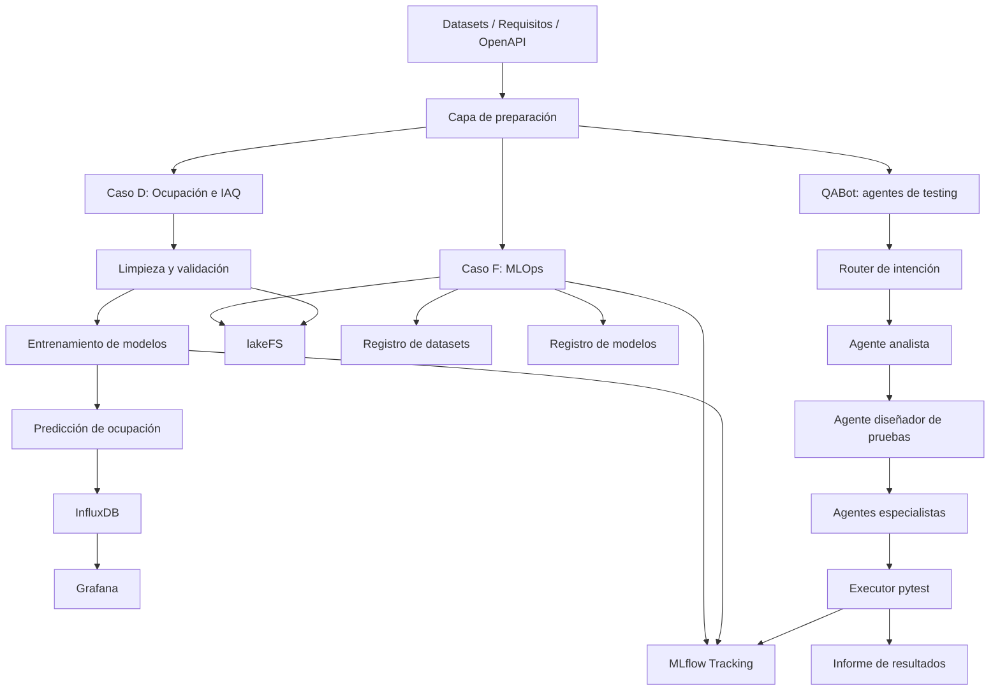
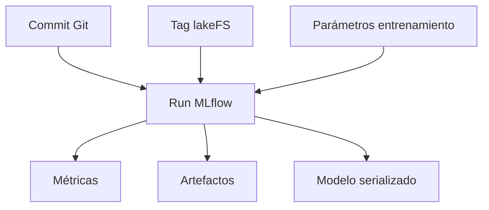
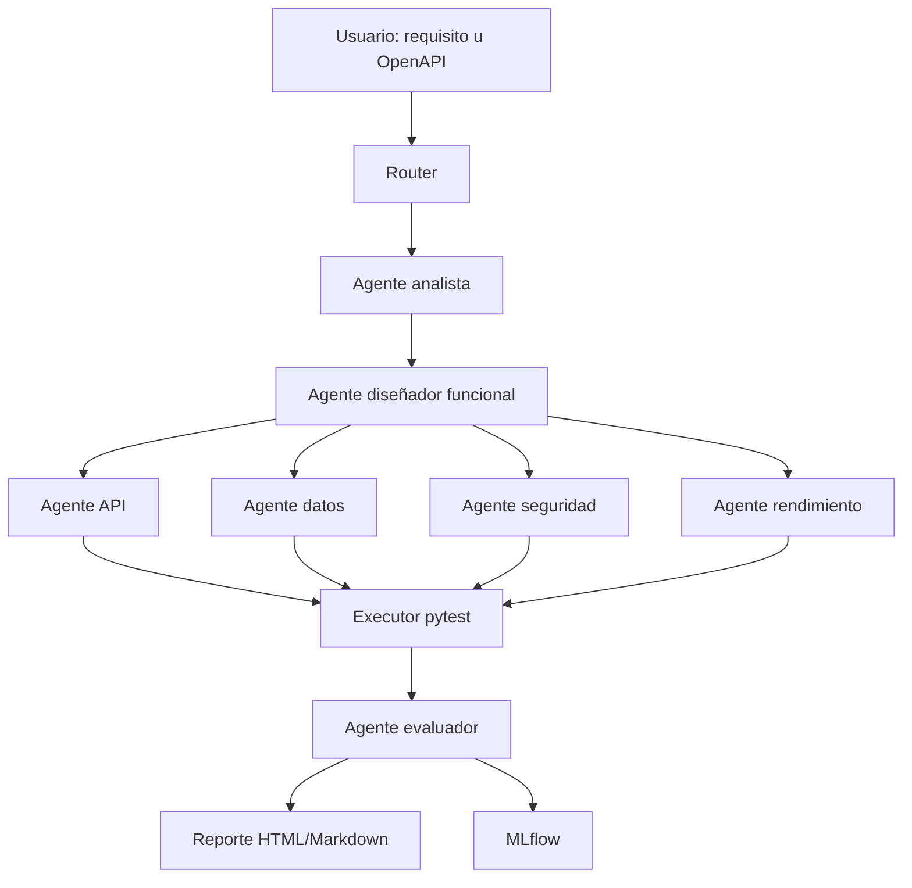

# Arquitectura del sistema

## 1. Objetivo

Construir una solución integrada para tres líneas de trabajo:

- MLOps y trazabilidad de modelos.
- Predicción de ocupación y calidad ambiental interior.
- Generación y evaluación de pruebas de calidad software mediante agentes especializados.

El sistema debe ser reproducible, demostrable y orientado a una futura reutilización en un entorno de edificio inteligente.

## 2. Vista general

## 3. Componentes

### 3.1 Capa de datos

Responsable de preparar los datasets utilizados por el proyecto.

Funciones:

- Cargar datos originales.
- Validar estructura y tipos.
- Detectar nulos, duplicados y rangos inválidos.
- Generar datasets procesados.
- Versionar datasets en lakeFS.

Datasets previstos:

- UCI Occupancy Detection para el MVP del caso D.
- In-Gauge / En-Gage como posible ampliación.
- Especificaciones OpenAPI o requisitos funcionales para QABot.

### 3.2 Caso D: calidad del aire, confort y ocupación

Objetivo:

Predecir si una estancia está ocupada a partir de variables ambientales como temperatura, humedad, luminosidad y CO₂.

Flujo:

Modelos previstos:

- Baseline por clase mayoritaria o regla simple.
- Logistic Regression.
- Random Forest.
- Gradient Boosting / XGBoost.
- SVM.

Métricas:

- Accuracy.
- Precision.
- Recall.
- F1-score.
- AUC-ROC.
- Matriz de confusión.

### 3.3 Caso F: MLOps

Objetivo:

Asegurar trazabilidad entre código, dataset, experimento, modelo y resultados.

Componentes:

- MLflow Tracking Server.
- lakeFS.
- Scripts comunes de logging.
- Convención de nombres de experimentos.
- Runbook reproducible.

Relación entre elementos:

### 3.4 QABot: asistentes agénticos de testing

Objetivo:

Construir un asistente que reciba requisitos o especificaciones API y produzca pruebas ejecutables, las lance y genere un informe de calidad.

Flujo:

## 4. Protocolos y herramientas

| Área | Herramientas |
|---|---|
| Lenguaje principal | Python |
| Notebooks | Jupyter |
| Experimentos | MLflow |
| Versionado de datos | lakeFS |
| Series temporales | InfluxDB |
| Visualización | Grafana |
| UI | Streamlit |
| Testing generado | pytest + requests |
| API demo | FastAPI |
| Calidad código | black, flake8, pytest |

## 5. Decisiones arquitectónicas

- Se usa **Streamlit** para la UI por rapidez de desarrollo y facilidad de demo.
- Se usa **MLflow** porque permite registrar parámetros, métricas, artefactos y modelos.
- Se usa **lakeFS** para versionar datasets sin subirlos a Git.
- Se usa **InfluxDB** porque las variables ambientales son series temporales.
- Se usa **Grafana** porque permite dashboards y alertas sobre InfluxDB.
- QABot usa **pytest + requests** para no depender de frameworks específicos de testing.

## 6. Criterios de aceptación técnica

- El sistema arranca con `docker compose up` o con comandos documentados.
- Hay al menos un dataset versionado en lakeFS.
- Hay experimentos registrados en MLflow.
- El caso D genera predicciones reproducibles.
- Grafana muestra datos de ocupación/IAQ.
- QABot genera pruebas ejecutables.
- QABot detecta fallos reales sobre una API demo.
- La documentación permite reproducir el entorno desde cero.
