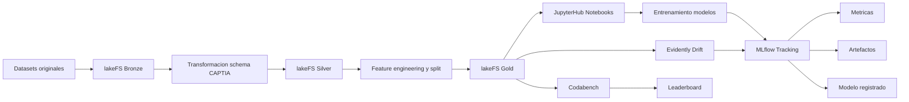
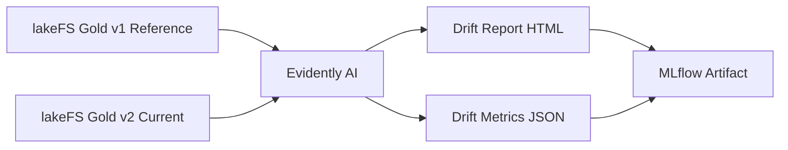

# Arquitectura técnica — Caso F MLOps CENTINELA+

## 1. Objetivo

El objetivo del caso F es implementar una infraestructura MLOps que permita gestionar datasets, experimentos y modelos
de forma reproducible, trazable y auditable.

La solución integra:

- **lakeFS** para versionado de datasets.
- **MLflow** para tracking de experimentos, métricas, modelos y artefactos.
- **JupyterHub** como entorno colaborativo de notebooks.
- **schema_captia.json** como contrato común de variables, tags y nomenclatura.
- **Evidently AI** como mejora para monitorización de drift.
- **Codabench** como mejora para comparación de modelos.

La arquitectura se diseña para el contexto académico del proyecto, pero manteniendo compatibilidad conceptual con una
futura integración en CENTINELA+.


## 2. Decisiones arquitectónicas principales

### 2.1 lakeFS como sistema de versionado de datasets

lakeFS se utiliza para versionar los datasets de entrada, las capas intermedias normalizadas y los datasets finales de
entrenamiento.

Cada dataset principal tiene su propio repositorio lakeFS:

```text
bdg2
ingauge
uci-appliances
uci-occupancy
lbnl-fdd
era5
```

Cada repositorio sigue una estructura Medallion:

```text
/bronze
/silver
/gold
/metadata
```

### 2.2 MLflow como sistema de tracking y registro de modelos

MLflow registra:

- Parámetros de entrenamiento.
- Métricas de evaluación.
- Artefactos.
- Modelos entrenados.
- Tags lakeFS usados como entrada.
- Versión del schema CAPTIA.
- Firma de entrenamiento.

Cada experimento MLflow debe poder responder:

```text
qué modelo se entrenó
con qué datos
con qué parámetros
con qué métricas
con qué artefactos
con qué versión de código
```

### 2.3 JupyterHub como entorno de trabajo colaborativo

JupyterHub proporciona un entorno común para que los equipos ejecuten notebooks de preparación de datos y entrenamiento
de modelos.

Los notebooks se usan para:

- Documentar decisiones.
- Ejecutar pipelines de datos.
- Entrenar modelos.
- Registrar experimentos en MLflow.
- Demostrar la trazabilidad completa.

### 2.4 No inclusión de InfluxDB en el MVP MLOps

La referencia general de CENTINELA+ define la capa Silver como una capa operacional compatible con CAPTIA, normalmente
representada mediante InfluxDB.

En este caso MLOps, se decide no incluir InfluxDB en el MVP para reducir complejidad. La capa Silver se simula en lakeFS
mediante datasets normalizados en formato Parquet/CSV siguiendo el contrato de `schema_captia.json`.

Esta decisión permite demostrar lo evaluable para MLOps:

- Versionado de datasets.
- Trazabilidad entre datasets y modelos.
- Registro de experimentos.
- Reproducibilidad.
- Integración lakeFS + MLflow.

La capa Silver generada en lakeFS mantiene compatibilidad lógica con una futura carga en InfluxDB.


## 3. Diagrama de arquitectura




## 4. Arquitectura Medallion aplicada

## 4.1 Capa Bronze

La capa Bronze contiene los datos originales sin modificar.

Ejemplo:

```text
lakefs://uci-appliances/bronze/energydata_complete.csv
```

Características:

- Conserva el formato original.
- No se eliminan nulos ni duplicados.
- No se renombran columnas.
- Sirve como fuente histórica de verdad.
- Se versiona con commit.


## 4.2 Capa Silver

La capa Silver contiene los datos normalizados al contrato definido en `schema_captia.json`.

En este proyecto se almacena en lakeFS como Parquet/CSV.

Estructura lógica:

```text
timestamp
captia_env
domain_id
site_id
asset_id
variable
value
metric_kind
unit
```

Ejemplo:

```text
timestamp,captia_env,domain_id,site_id,asset_id,variable,value,metric_kind,unit
2016-01-11T17:00:00Z,prod,bms_buildings,uci_appliances,HOUSE01,power_01,60,counter,Wh
2016-01-11T17:00:00Z,prod,bms_buildings,uci_appliances,HOUSE01,temperature_outdoor,6.6,analog_gauge,°C
```

Ejemplo de ruta:

```text
lakefs://uci-appliances/silver/captia_points.parquet
```


## 4.3 Capa Gold

La capa Gold contiene datasets específicos para los casos de uso.

Ejemplo para predicción de consumo:

```text
lakefs://uci-appliances/gold/train.parquet
lakefs://uci-appliances/gold/test.parquet
```

Puede incluir:

- Features temporales.
- Variables objetivo.
- Splits train/test.
- Esquemas de features.
- Informes de calidad.
- Metadatos de lineage.

Ejemplo de tag:

```text
uci-appliances_v1
```

Este tag debe registrarse en MLflow en todos los runs de entrenamiento.


## 5. Lineage de datos

Cada capa debe mantener la relación con la anterior.

Ejemplo de `metadata/lineage.json`:

```json
{
  "dataset": "uci-appliances",
  "schema_captia_version": "1.0",
  "bronze": {
    "path": "bronze/energydata_complete.csv"
  },
  "silver": {
    "path": "silver/captia_points.parquet"
  },
  "gold": {
    "tag": "uci-appliances_v1",
    "path_train": "gold/train.parquet",
    "path_test": "gold/test.parquet"
  }
}
```


## 6. Integración con MLflow

Cada entrenamiento debe registrar en MLflow:

```text
lakefs_tag
schema_captia_version
algorithm
hyperparameters
metrics
model artifact
training_signature
```

Ejemplo:

```python
mlflow.set_tags({
    "caso": "B",
    "dataset": "uci-appliances",
    "schema": "captia",
    "schema_captia_version": "1.0",
    "lakefs_tag": "uci-appliances_v1",
    "gold_train_path": "gold/train.parquet",
    "gold_test_path": "gold/test.parquet",
    "target_variable": "power_01"
})
```


## 7. Convención de experimentos MLflow

Los experimentos son contenedores permanentes por problema.

Formato:

```text
Caso[letra]_[descripcion_del_problema]
```

Ejemplos:

```text
CasoB_Prediccion_de_consumo_electrico
CasoC_Deteccion_de_anomalias_HVAC
CasoD_Calidad_aire_confort_ocupacion
CasoE_Meteorologia_integracion_exterior_interior
```

Los runs siguen el formato:

```text
[algoritmo]_[fecha]_[descripcion_corta]
```

Ejemplos:

```text
BaselineMean_20260510_baseline
XGBoost_20260510_gold_v1
RandomForest_20260510_features_temporales
IsolationForest_20260510_hvac_v1
```


## 8. Pipeline MLOps

## 8.1 Modo manual reproducible

El MVP se ejecuta desde JupyterHub:

```text
1. Ejecutar 01_prepare_dataset.ipynb.
2. Generar Bronze, Silver y Gold en lakeFS.
3. Crear commits y tags.
4. Ejecutar 02_train_model.ipynb.
5. Entrenar baseline y modelo candidato.
6. Registrar resultados en MLflow.
```

## 8.2 Modo automático opcional

La mejora de CI/CD permite ejecutar:

```text
1. Detección de cambios en datos o código.
2. Regeneración de datasets si procede.
3. Reutilización de tags si no hay cambios.
4. Reentrenamiento si cambia dataset, parámetros o código.
5. Reutilización del modelo si la firma de entrenamiento ya existe.
```

Firma de entrenamiento:

```text
training_signature = hash(
  lakefs_tag,
  algorithm,
  hyperparameters,
  code_commit,
  feature_set_version
)
```


## 9. Monitorización de drift con Evidently AI

## 9.1 Objetivo

La monitorización de drift permite detectar si la distribución de los datos actuales cambia respecto al dataset usado
para entrenar el modelo.

Esto es importante porque un modelo puede degradarse aunque el código no cambie.

## 9.2 Diseño aplicado

Se comparan dos versiones Gold de lakeFS:

```text
reference dataset:
  dataset usado para entrenar el modelo actual

current dataset:
  nueva versión del dataset generada tras una actualización de datos
```

Ejemplo:

```text
reference_tag = uci-appliances_v1
current_tag   = uci-appliances_v2
```

## 9.3 Flujo

```text
1. Leer reference dataset desde lakeFS.
2. Leer current dataset desde lakeFS.
3. Ejecutar Evidently Data Drift Report.
4. Generar informe HTML/JSON.
5. Registrar el informe como artefacto en MLflow.
6. Registrar métricas agregadas de drift.
```

## 9.4 Diagrama



## 9.5 Métricas registradas

Métricas recomendadas:

```text
dataset_drift_detected
share_of_drifted_columns
number_of_drifted_columns
```

Ejemplo MLflow:

```python
mlflow.log_metric("dataset_drift_detected", int(dataset_drift_detected))
mlflow.log_metric("share_of_drifted_columns", share_of_drifted_columns)
mlflow.log_metric("number_of_drifted_columns", number_of_drifted_columns)
mlflow.log_artifact("reports/drift_report.html")
```

## 9.6 Decisión arquitectónica

Evidently no se ejecuta como servicio permanente en el MVP.

Se usa como librería Python dentro de la pipeline o notebook de validación. Esta decisión reduce complejidad y permite
registrar los informes directamente en MLflow.


## 10. Codabench

## 10.1 Objetivo

Codabench se utiliza como mejora avanzada para comparar modelos de predicción de consumo entre equipos.

El objetivo es definir un entorno común de evaluación donde todos los equipos puedan enviar predicciones y obtener
métricas comparables.

## 10.2 Caso seleccionado

El caso más adecuado para Codabench es:

```text
Caso B — Predicción de consumo eléctrico
```

Motivo:

- Tiene variable objetivo clara.
- Permite métricas estándar de regresión.
- Facilita comparación entre modelos.
- Es comprensible para la demo.

## 10.3 Métricas de evaluación

Métricas recomendadas:

```text
MAE
RMSE
MAPE
R2
```

La métrica principal puede ser:

```text
RMSE
```

## 10.4 Estructura del bundle

```text
codabench/
├── competition.yaml
├── scoring_program/
│   ├── scoring.py
│   └── metadata.yaml
├── ingestion_program/
│   ├── ingestion.py
│   └── metadata.yaml
├── reference_data/
│   └── y_test.csv
├── sample_submission/
│   └── predictions.csv
├── baseline/
│   └── baseline_last_value.csv
└── README.md
```

## 10.5 Flujo de evaluación

```text
1. El equipo descarga el dataset de test sin etiquetas.
2. Genera un fichero predictions.csv.
3. Sube la submission a Codabench.
4. Codabench ejecuta scoring.py.
5. scoring.py compara predictions.csv con y_test.csv.
6. Se generan métricas.
7. El leaderboard muestra la comparación.
```

## 10.6 Formato de submission

```csv
timestamp,prediction
2016-04-01T00:00:00Z,56.2
2016-04-01T00:10:00Z,58.1
```

## 10.7 Formato de scores.json

```json
{
  "mae": 12.3,
  "rmse": 18.7,
  "mape": 8.4,
  "r2": 0.81
}
```

## 10.8 Relación con MLflow

El baseline publicado en Codabench también debe estar registrado en MLflow.

MLflow conserva:

```text
modelo baseline
parámetros
métricas internas
dataset lakeFS usado
artefactos
```

Codabench conserva:

```text
comparación pública entre submissions
leaderboard
métricas de evaluación externas
```

Ambas herramientas son complementarias.


## 11. Baselines

Cada caso de uso debe tener una baseline obligatoria.

Ejemplos:

```text
CasoB:
  media histórica
  último valor observado

CasoC:
  umbral simple
  reglas básicas por temperatura/estado

CasoD:
  clase mayoritaria
  regresión logística simple
```

Cada baseline debe registrarse en MLflow y consumir un tag Gold de lakeFS.


## 12. Calidad de datos

Cada capa genera un informe de calidad.

## 12.1 Bronze

Validaciones:

```text
fichero existe
formato correcto
filas y columnas detectadas
hash de fichero original
```

## 12.2 Silver

Validaciones:

```text
timestamp válido
cinco tags CAPTIA presentes
variables existentes en captia_schema.json
value numérico
metric_kind válido
unidad coherente
```

## 12.3 Gold

Validaciones:

```text
train/test separados sin leakage temporal
variable objetivo presente
features esperadas presentes
nulos críticos controlados
número de filas suficiente
split documentado
```

Los informes se guardan en lakeFS:

```text
metadata/quality/
gold/quality_report.json
```


## 13. Seguridad y gestión de secretos

No se versionan credenciales reales.

El repositorio solo contiene:

```text
.env.example
```

El fichero `.env` real se mantiene fuera de Git.

No se suben a Git:

```text
datasets grandes
modelos entrenados
artefactos MLflow
credenciales
volúmenes Docker
```

Los datasets se gestionan en lakeFS. Los modelos y artefactos se gestionan en MLflow.


## 14. Justificación final

La arquitectura elegida prioriza reproducibilidad y trazabilidad.

El sistema permite demostrar:

```text
Dataset original
  → versión Bronze en lakeFS
  → normalización Silver compatible con CAPTIA
  → dataset Gold de entrenamiento
  → entrenamiento en JupyterHub
  → experimento MLflow
  → modelo y artefactos registrados
  → evaluación avanzada con drift y Codabench
```

La infraestructura evita depender de sistemas externos no disponibles, pero mantiene una estructura compatible con una
futura integración en CENTINELA+.
