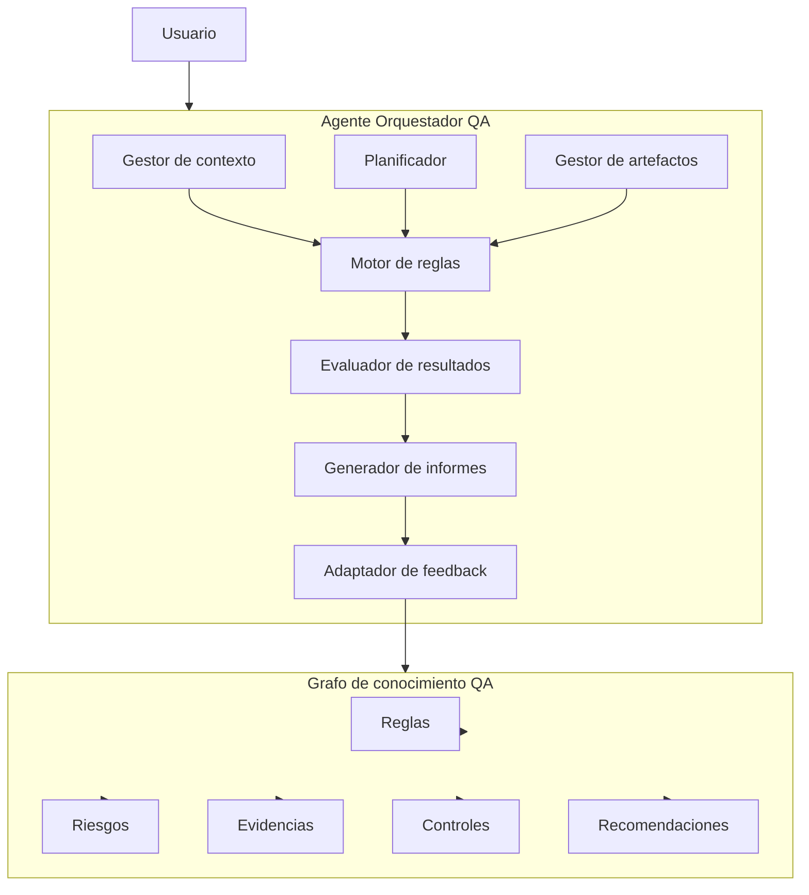
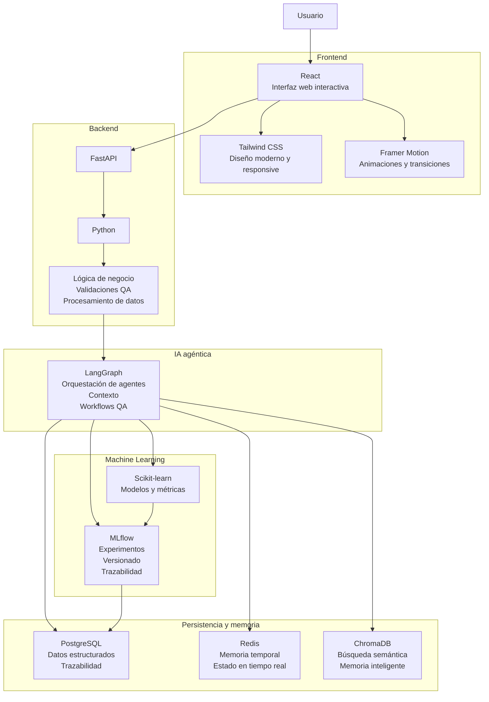
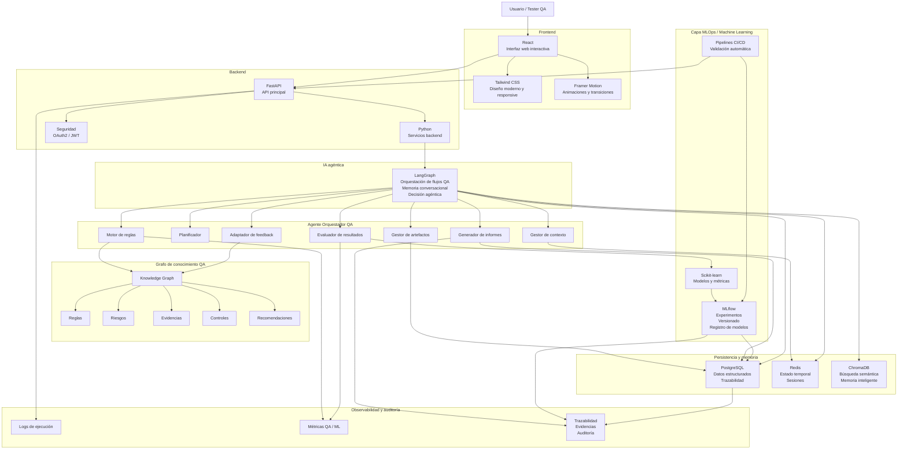

# QABot - Asistente QA para Oficina de test en proyectos de Ciclo del Dato

## Descripción

QABot es un agente orquestador orientado al aseguramiento de calidad (QA) en proyectos de datos, IA y Machine Learning.

El sistema guía al usuario durante iteraciones de prueba, validando artefactos, ejecutando controles basados en reglas y generando informes de resultados.

# Objetivo

Desarrollar un agente orquestador de asistencia QA que acompañe al usuario durante iteraciones de prueba de un proyecto de datos/ML, solicitando artefactos, ejecutando validaciones basadas en reglas, reportando defectos, recogiendo feedback, generando informes, etc.

La v1 estará basada en reglas definidas por testers expertos almacenadas en un grafo de conocimiento que relaciona fases del ciclo del dato, riesgos, controles, evidencias y recomendaciones.

---

# Cobertura funcional

El ciclo de pruebas incluye numerosas fases dependiendo del propósito. No se ejecuta igual un plan de pruebas en la primera iteración que en una regresión funcional tras varias iteraciones, al igual que realizar pruebas sobre errores resueltos, pruebas de carga o pruebas de integración.

En este caso vamos a desarrollar la disciplina de prueba de ciclo del dato, que tiene fases específicas ligadas al ciclo de desarrollo de una solución de IA y Big Data.

## Casos de uso generales del agente orquestador

1. Iniciar una sesión de validación.
2. Entender el objetivo del usuario.
3. Solicitar artefactos necesarios.
4. Guiar al usuario cuando falte información.
5. Mantener contexto durante la conversación.
6. Gestionar varias iteraciones de análisis.
7. Presentar resultados de forma comprensible.
8. Permitir profundizar en defectos detectados.
9. Recoger feedback del usuario.
10. Ofrecer generación de informe de pruebas.
11. Cerrar la sesión con trazabilidad.

---

# Ciclo del dato

El ciclo del dato puede incluir distintas tareas dependiendo del objetivo de negocio, la técnica de IA aplicada, el dominio de los datos, etc., especialmente en desarrollos avanzados multimodales y agénticos.

## Tareas habituales del ciclo del dato

1. Ingesta de datos
2. Selección y filtrado
3. Calidad de los datos
4. Limpieza
5. Preparación y transformación
6. División de datasets (train/validation/test)
7. Selección de algoritmos
8. Entrenamiento del modelo
9. Evaluación del modelo
10. Métricas de desempeño
11. Explicabilidad
12. Empaquetado
13. Despliegue en producción

---

# Especialización por dominio

Estas fases pueden especializarse según el dominio de los datos.

Por ejemplo, en soluciones NLP es necesario asegurar la calidad en la transformación de texto a tokens (vectores numéricos) para permitir la aplicación de algoritmos de Machine Learning.

Por ello, se incluirá una subfase específica de validación de codificación del texto dentro del apartado de calidad de los datos.

---

# Alcance de la versión v1

La versión v1 estará limitada a los casos de uso principales y a las tareas del ciclo del dato más asequibles, ya que se trata de un piloto dentro del contexto del proyecto integrador del curso de especialización.

No obstante, el sistema quedará preparado para incorporar posteriormente nuevas pruebas, reglas y tareas de ciclo del dato.

---

# Funcionalidades iniciales del asistente orquestador

1. Iniciar una sesión de pruebas.
2. Entender el objetivo del usuario.
   - Ejemplos:
     - Ejecutar un plan de pruebas.
     - Realizar una regresión.
     - Crear defectos en Azure DevOps.
3. Solicitar artefactos necesarios para el objetivo solicitado.
4. Guiar al usuario cuando falte información.
5. Reportar resultados de las pruebas.
6. Solicitar feedback para mejora continua adaptando el grafo de conocimiento de forma autoincremental.

---

# Tareas iniciales del ciclo del dato contempladas en v1

## 1. Calidad de los datos

### a. Calidad de datos general

- Valores nulos
- Duplicados
- Tipado incorrecto
- Inconsistencias
- Distribuciones anómalas

### b. Calidad de datos en problemas NLP

- Validación de codificación de texto
- Caracteres inválidos
- Tokenización
- Longitud de secuencias
- Normalización

---

## 2. División de datasets

Validación de la correcta separación de los conjuntos:

- Entrenamiento
- Validación
- Pruebas

Se comprobarán aspectos como:

- Proporciones esperadas
- Fuga de datos
- Balance de clases

---

## 3. Evaluación del modelo

Ejemplos de propiedades a evaluar:

- Estabilidad
- Robustez
- Tiempo de ejecución

Las propiedades concretas serán definidas tras validar el alcance definitivo de la v1.

---

## 4. Métricas de evaluación

Ejemplos iniciales:

- Precisión
- Accuracy
- Error cuadrático medio (MSE)

Las métricas definitivas incluidas en v1 se determinarán posteriormente según el tipo de solución ML/NLP objetivo.

---

# Etapas agénticas y motor de reglas

Los agentes inteligentes siguen una serie de etapas para identificar la tarea que le solicitan, planificar la mejor propuesta de acción, ejecutar las acciones planificadas, evaluar el resultado de sus acciones, aprender, etc.

Estas etapas pueden utilizar patrones predefinidos de comportamiento que van desde reglas sencillas hasta mecanismos cognitivos sofisticados.

La v1 incluirá un motor de validación basado en reglas definidas por expertos en QA. Es decir, las etapas agénticas estarán basadas inicialmente en reglas básicas.

Con esta aproximación se asegura la entrega de una versión funcional, aunque limitada en inteligencia autónoma, que podrá evolucionar progresivamente tanto durante el desarrollo del proyecto como posteriormente en entornos profesionales reales.

Las reglas se almacenarán en una estructura de grafo de conocimiento para que la implementación del comportamiento del agente sea extensible mediante:

- Inclusión manual de nuevas reglas.
- Ajuste o eliminación de reglas existentes.
- Procesos asistidos de mejora continua.
- Sustitución progresiva de reglas por componentes inteligentes capaces de inferir automáticamente reglas de negocio.

---

# Ciclo agéntico propuesto

## 1. Comprensión de la solicitud

El agente interpreta:

- Objetivo del usuario.
- Tipo de pruebas solicitadas.
- Contexto funcional.
- Artefactos disponibles.
- Restricciones de ejecución.

### Ejemplos

- Ejecutar plan de pruebas.
- Realizar regresión funcional.
- Validar calidad de datos.
- Evaluar métricas del modelo.

---

## 2. Planificación

El sistema determina:

- Fases de validación necesarias.
- Reglas aplicables.
- Evidencias requeridas.
- Orden óptimo de ejecución.
- Dependencias entre tareas.

---

## 3. Ejecución

El agente:

- Solicita artefactos.
- Ejecuta validaciones.
- Aplica reglas QA.
- Detecta incumplimientos.
- Registra evidencias.

---

## 4. Evaluación de resultados

El sistema analiza:

- Resultado de las validaciones.
- Severidad de defectos.
- Cobertura de pruebas.
- Riesgos identificados.
- Calidad de las evidencias.

---

## 5. Retroalimentación y aprendizaje

El agente recopila feedback del usuario para:

- Mejorar reglas existentes.
- Refinar recomendaciones.
- Incorporar nuevos patrones.
- Adaptar el grafo de conocimiento.

---

# Motor de reglas

El motor de reglas constituye el núcleo lógico de la v1.

## Funciones principales

- Ejecutar validaciones automáticas.
- Detectar anomalías.
- Aplicar controles QA.
- Relacionar riesgos y evidencias.
- Generar recomendaciones.
- Priorizar defectos.

---

# Tipos de reglas iniciales

## Reglas de calidad de datos

### Ejemplos

- Detección de nulos.
- Validación de tipos.
- Duplicados.
- Distribuciones anómalas.
- Valores fuera de rango.

---

## Reglas NLP

### Ejemplos

- Validación de codificación UTF-8.
- Caracteres inválidos.
- Tokenización incorrecta.
- Longitudes máximas.
- Normalización textual.

---

## Reglas de datasets

### Ejemplos

- Separación train/test.
- Detección de fuga de datos.
- Balance de clases.
- Representatividad.

---

## Reglas de evaluación del modelo

### Ejemplos

- Tiempo máximo de ejecución.
- Robustez ante entradas inválidas.
- Estabilidad entre ejecuciones.
- Umbrales mínimos de métricas.

---

# Grafo de conocimiento

Las reglas estarán almacenadas en un grafo de conocimiento para permitir un modelo flexible, extensible y evolutivo.

## Relaciones principales

El grafo relacionará:

- Fases del ciclo del dato.
- Riesgos.
- Controles.
- Evidencias.
- Reglas.
- Recomendaciones.
- Defectos.
- Métricas.

---

# Ventajas del enfoque basado en grafo

## Extensibilidad

Permite:

- Añadir nuevas reglas.
- Ajustar comportamientos.
- Incorporar nuevas fases QA.
- Adaptar el sistema a nuevos dominios.

---

## Trazabilidad

Facilita conocer:

- Qué regla se ejecutó.
- Qué evidencia se utilizó.
- Qué riesgo se detectó.
- Qué recomendación se generó.

---

## Evolución progresiva

El sistema podrá evolucionar mediante:

- Inclusión manual de nuevas reglas.
- Ajustes derivados del feedback.
- Mejora continua asistida.
- Sustitución progresiva de reglas por componentes inteligentes.

---

# Evolución futura

En versiones posteriores, determinadas fases o procesos podrán reemplazar las reglas estáticas por componentes inteligentes capaces de:

- Inferir patrones automáticamente.
- Aprender comportamientos QA.
- Detectar anomalías complejas.
- Generar nuevas reglas.
- Adaptarse dinámicamente al dominio del proyecto.

Esto permitirá evolucionar desde un sistema basado en reglas hacia un agente QA híbrido con capacidades cognitivas avanzadas.

---

# Enfoque técnico propuesto para v1

## Arquitectura funcional propuesta

# Arquitectura tecnológica propuesta (no definitiva)

# Arquitectura híbrida (no definitiva)

---

# Componentes principales

## 1. Agente orquestador

Responsable de:

- Gestionar la conversación.
- Guiar al usuario.
- Ejecutar flujos de prueba.
- Solicitar evidencias.
- Consolidar resultados.

---

## 2. Grafo de conocimiento

Contendrá relaciones entre:

- Fases del ciclo del dato.
- Riesgos.
- Controles.
- Evidencias.
- Recomendaciones.
- Defectos.
- Métricas.

---

## 3. Motor de reglas

Permitirá:

- Ejecutar validaciones automáticas.
- Detectar incumplimientos.
- Generar recomendaciones.
- Priorizar riesgos.

---

## 4. Sistema de feedback

Permitirá:

- Recoger validaciones humanas.
- Mejorar reglas existentes.
- Incorporar nuevo conocimiento.
- Evolucionar el grafo de conocimiento.

---

# Posibles tecnologías

## Backend

- Python
- FastAPI
- LangChain / LangGraph
- Neo4j
- Pandas
- Scikit-learn

## Persistencia

- Neo4j (grafo)
- PostgreSQL
- Azure Storage / Blob Storage

## IA y orquestación

- OpenAI API
- Azure OpenAI
- LangGraph

## Frontend

- Streamlit
- React
- Next.js

---

# Objetivo futuro

Evolucionar el piloto hacia una metodología de pruebas completa para proyectos de IA y Big Data, soportando:

- Testing multimodal
- Testing agéntico
- Evaluación continua
- Observabilidad
- Trazabilidad avanzada
- Integración DevOps/MLOps