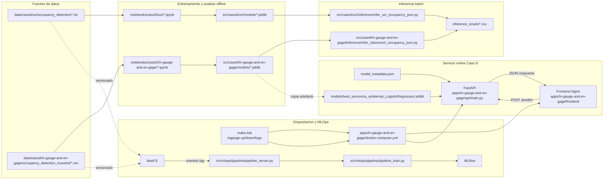

# Arquitectura de Caso D

## Objetivo

El **Caso D** implementa un sistema de clasificacion binaria para inferir ocupacion de aulas a partir de señales
ambientales, sin usar camaras ni sensores de presencia directa.

La arquitectura combina:

1. Flujo de datos y entrenamiento offline.
2. Inferencia batch por script.
3. Inferencia online con API FastAPI y frontend web.
4. Soporte MLOps del proyecto para versionado, trazabilidad y reentrenamiento.

## Diagrama de arquitectura

## Componentes principales

- **Datos**: `data/casod/uci` y `data/casod/In-gauge-and-en-gage`.
- **Analisis/entrenamiento**: notebooks en `notebooks/casoD/...`.
- **Modelos entrenados**: artefactos `.joblib` en `src/cased/.../models`.
- **Inferencia batch**: scripts en `src/cased/.../inference` con salida CSV.
- **API online**: `apps/In-gauge-and-en-gage/api/main.py` expone `GET /health`, `GET /metadata`, `POST /predict`.
- **Frontend online**: `apps/In-gauge-and-en-gage/frontend/app.js` consume la API y renderiza la prediccion.
- **Contenerizacion**: `apps/In-gauge-and-en-gage/docker-compose.yml` publica frontend (`8080`) y API (`8000`).

## Flujos de ejecucion

### 1) Entrenamiento offline

1. Se cargan datasets UCI e In-gauge.
2. Se realiza EDA, limpieza y seleccion de variables en notebooks.
3. Se entrenan modelos candidatos.
4. Se exporta el mejor modelo (`.joblib`) y su metadata.

### 2) Inferencia batch

1. Se leen casos simulados desde `simulated_cases.json`.
2. Se valida esquema de entrada y tipos.
3. Se ejecuta prediccion con el modelo local.
4. Se generan resultados tabulados (`inference_results*.csv`).

### 3) Inferencia online (demo operativa)

1. El usuario ajusta sliders en el frontend (temperatura, humedad, CO2, ruido).
2. El frontend invoca `POST /predict`.
3. La API carga modelo + metadata y calcula clase/probabilidades.
4. La respuesta JSON actualiza el estado visual del aula.

## Relacion con `make.bat`

Para el despliegue del caso D en modo app, `make.bat` usa objetivos dedicados:

- `make.bat ingauge-up`
- `make.bat ingauge-down`
- `make.bat ingauge-logs`

Estos objetivos delegan en `apps/In-gauge-and-en-gage/docker-compose.yml` para levantar/parar frontend y API.

