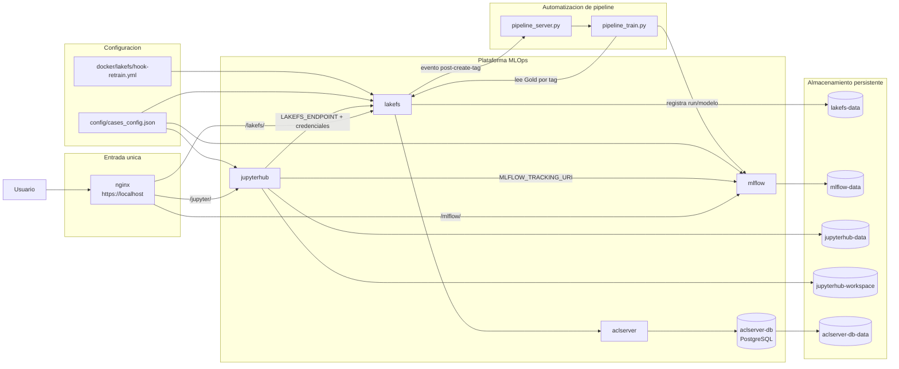

# Arquitectura de infraestructura MLOps (Caso F)

## Objetivo

El **Caso F** define la infraestructura MLOps del proyecto para cubrir:

1. versionado de datasets,
2. tracking y registro de modelos,
3. entorno colaborativo de notebooks,
4. control de acceso por caso,
5. disparo automatico de reentrenamiento.

## Diagrama de arquitectura

## Componentes principales

- `nginx`: reverse proxy TLS y punto de acceso unico.
- `jupyterhub`: entorno multiusuario para notebooks y ejecucion de pipelines.
- `lakefs`: versionado Git-like para datos (repos, ramas, tags, commits).
- `aclserver` + `aclserver-db`: autorizacion RBAC de lakeFS.
- `mlflow`: tracking de experimentos y model registry.
- `pipeline_server.py`: receptor de webhooks de lakeFS.
- `pipeline_train.py`: reentrenamiento automatico y registro en MLflow.

## Flujo operativo

### 1) Arranque de infraestructura

Desde `make.bat`:

- `make.bat init`: valida `.env`, genera `requirements.txt` de JupyterHub y certificados TLS.
- `make.bat build`: construye imagenes del stack MLOps.
- `make.bat start`: levanta `aclserver-db`, `aclserver`, `lakefs`, `mlflow`, `jupyterhub`, `nginx`.
- `make.bat stop` / `make.bat destroy`: parada normal o eliminacion con volumenes.

### 2) Bootstrap de servicios

1. `lakefs` ejecuta `entrypoint.sh` + `init_lakefs.sh`:
   crea usuarios por caso, permisos RBAC, repositorios y hook de reentrenamiento.
2. `mlflow` ejecuta `entrypoint.sh` + `init_mlflow.py`:
   crea/actualiza experimentos y modelos registrados desde `cases_config.json`.
3. `jupyterhub` ejecuta `entrypoint.sh`:
   crea usuarios `admin` y `caso*`, arranca el webhook server y levanta el Hub.

### 3) Reentrenamiento automatico

1. Un nuevo tag en lakeFS dispara `post-create-tag`.
2. `pipeline_server.py` valida el evento (`trigger_resolver.py`).
3. Se lanza `pipeline_train.py` en segundo plano.
4. El pipeline descarga `gold/train.parquet` y `gold/test.parquet` por tag.
5. Entrena, evalua y registra metricas/modelo en MLflow.
6. Promueve la ultima version al alias `staging` en Model Registry.

## Rutas de acceso unificadas

- `https://localhost/jupyter/`
- `https://localhost/mlflow/`
- `https://localhost/lakefs/`

