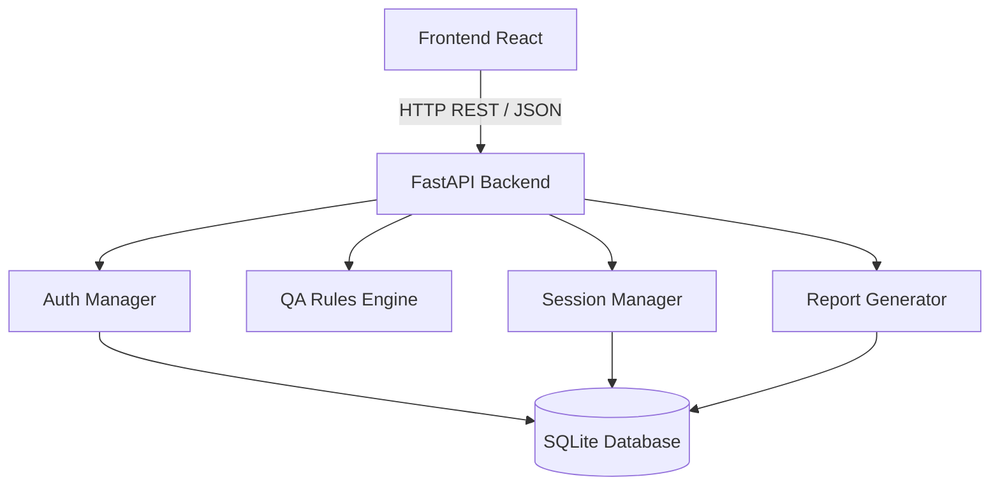

# Arquitectura del Sistema - QA Bot

## Objetivo

Este documento describe la arquitectura software de la plataforma QA Bot, incluyendo:

- componentes principales  
- responsabilidades  
- flujo de ejecución  
- decisiones arquitectónicas  
- comunicación entre servicios  
- diagrama del sistema  

La plataforma está diseñada como un sistema modular para la ejecución de ciclos de Quality Assessment sobre datasets y modelos de Machine Learning.

---

## Visión general de la arquitectura

La solución sigue una arquitectura cliente-servidor separada en:

- frontend React  
- backend FastAPI  
- gestor de autenticación y seguridad  
- motor de reglas QA  
- sistema de sesiones  
- generador de reportes  
- persistencia relacional ligera (SQLite)  

---

## Arquitectura lógica



---

## Componentes principales

### Frontend

Tecnología:

- React  
- TailwindCSS  
- Vite  

Responsabilidades:

- interfaz conversacional  
- login y registro de usuarios  
- subida de datasets  
- visualización de informes  
- gestión de iteraciones  
- restauración de sesiones  
- visualización de métricas QA  

---

### Backend

Tecnología:

- FastAPI  
- Python  

Responsabilidades:

- recepción de peticiones HTTP  
- gestión de seguridad (validación de usuarios)  
- ejecución de validaciones QA  
- análisis de datasets  
- gestión de sesiones  
- persistencia de resultados  
- generación de informes  
- análisis documental  

El backend actúa como núcleo orquestador del sistema.

---

## Motor de reglas QA

El motor QA contiene reglas especializadas para validación de datasets y modelos.

### Calidad de tabla

- valores nulos
- duplicados
- outliers
- consistencia de tipos
- balanceo de clases
- validación de asimetría

### Validación de particiones

- train / validation / test
- fuga de IDs
- estabilidad del target
- distribución de datos

### Evaluación de modelos

- accuracy
- precision
- recall
- F1
- ROC AUC

---

## Session Manager

Gestiona la persistencia de los ciclos QA vinculados a cada usuario.

Cada sesión almacena:

- mensajes
- iteraciones
- resultados
- prompts activos
- metadatos

Permite restaurar estados anteriores del sistema.

---

## Report Generator

Genera informes estructurados con:

- métricas  
- incidencias y hallazgos  
- estado global  
- comparación con iteraciones anteriores  
- trazabilidad de ejecución  

---

## Flujo de ejecución

### 1. Autenticación

El usuario se registra o inicia sesión.

---

### 2. Inicio del ciclo

El usuario crea o recupera una sesión QA.

---

### 3. Solicitud del usuario

Ejemplos:

- “Valida calidad del dataset”  
- “Evalúa el modelo”  

---

### 4. Subida de dataset

Se envía mediante `multipart/form-data`.

---

### 5. Inferencia automática

El backend detecta:

- tipo de validación  
- contexto del dataset  
- fase del ciclo QA  

---

### 6. Ejecución de reglas

El motor QA ejecuta validaciones.

---

### 7. Generación de informe

Se generan:

- métricas  
- errores detectados  
- estado global  
- comparación entre iteraciones  

---

### 8. Persistencia

Se guarda el estado de la sesión y resultados en la base de datos.

---

### 9. Visualización

El frontend renderiza resultados y métricas.

---

## Arquitectura de carpetas

```text
apps/qabot/
├── backend/
│   ├── app/
│   │   ├── routes/
│   │   ├── schemas/
│   │   ├── services/
│   │   └── main.py
│   ├── requirements.txt
│   └── Dockerfile
├── frontend/
│   ├── public/
│   ├── src/
│   │   ├── components/
│   │   ├── hooks/
│   │   ├── App.jsx
│   │   └── AppRouter.jsx
│   ├── package.json
│   └── Dockerfile
└── docker-compose.yml
```

---

## Comunicación entre componentes

### Frontend → Backend

Comunicación mediante API REST:

| Endpoint | Método | Función |
|----------|--------|----------|
| /auth/login | POST | Login de usuario |
| /auth/register | POST | Registro de usuario |
| /chat | POST | Ejecutar QA |
| /sessions | GET/POST | Gestión de sesiones |
| /sessions/metadata | PUT | Actualizar metadatos |
| /download/{execution_id} | GET | Descarga de informe PDF |
| /conceptual-documents/analyze | POST | Análisis documental |

---

## Decisiones arquitectónicas

### Separación frontend/backend

Se eligió arquitectura desacoplada para:

- modularidad  
- escalabilidad  
- mantenimiento independiente  

---

### FastAPI como backend

Se eligió por:

- alto rendimiento  
- documentación automática (Swagger)  
- integración directa con stack Python (Pandas, Scikit-learn)  

Alternativa descartada:
- Flask, por menor estructura en proyectos complejos  

---

### React en frontend

Se eligió por:

- arquitectura basada en componentes  
- ecosistema maduro  
- facilidad para dashboards dinámicos  

Alternativa descartada:
- Angular, por mayor complejidad en un MVP  

---

### SQLite como persistencia

Se eligió por:

- simplicidad  
- cero configuración  
- adecuado para entorno académico y PoC  

Alternativa descartada:
- PostgreSQL, por sobrecarga innecesaria en esta fase  

---

### Motor QA independiente

Se diseñó separado para:

- escalabilidad del sistema  
- extensión de reglas  
- desacoplar lógica de negocio del backend  

---

## Conclusión

QA Bot implementa una arquitectura modular basada en separación de responsabilidades, facilitando:

- mantenibilidad  
- escalabilidad  
- extensión futura del sistema  
- claridad conceptual del diseño  
