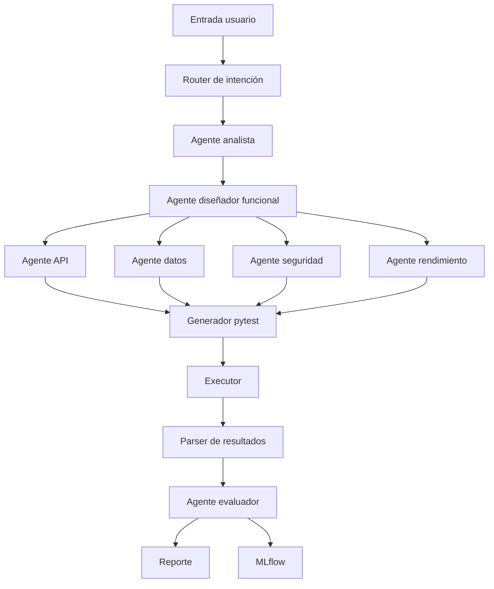

# Arquitectura de QABot

## 1. Objetivo

Diseñar un sistema agéntico de testing con responsabilidades separadas.

QABot transforma requisitos o especificaciones API en pruebas ejecutables y en un informe de calidad.

## 2. Vista general



## 3. Componentes

### 3.1 Router de intención

Responsabilidad:

Clasificar qué quiere hacer el usuario.

Intenciones mínimas:

- `analyze_requirement`
- `generate_tests`
- `execute_tests`
- `explain_failure`
- `generate_report`

Entrada:

```json
{
  "user_input": "...",
  "input_type": "natural_language | openapi | user_story"
}
```

Salida:

```json
{
  "intent": "generate_tests",
  "confidence": 0.91,
  "next_agent": "analyst"
}
```

### 3.2 Agente analista

Responsabilidad:

Extraer reglas de negocio, entidades, restricciones, endpoints, datos obligatorios y riesgos.

Salida:

```json
{
  "entities": ["room", "measurement", "iaq"],
  "business_rules": ["CO2 must be between 300 and 5000 ppm"],
  "risks": ["invalid environmental ranges are accepted"]
}
```

### 3.3 Agente diseñador funcional

Responsabilidad:

Crear casos de prueba abstractos.

Tipos:

- Positivos.
- Negativos.
- Frontera.
- Equivalencia.
- Regresión.

### 3.4 Agente API

Responsabilidad:

Convertir casos abstractos en pruebas API ejecutables con `pytest` y `requests`.

Salida:

```text
tests/generated/test_rooms_iq.py
```

### 3.5 Agente de calidad de datos

Responsabilidad:

Generar pruebas centradas en:

- Nulos.
- Tipos incorrectos.
- Rangos imposibles.
- Valores duplicados.
- Timestamps inválidos.

### 3.6 Agente de seguridad básica

Responsabilidad:

Generar pruebas no destructivas:

- Falta de token.
- Token inválido.
- Payload malformado.
- Parámetros inesperados.
- Tamaño excesivo controlado.

No realiza ataques ofensivos.

### 3.7 Agente de rendimiento básico

Responsabilidad:

Medir tiempos de respuesta simples.

Métricas:

- Latencia media.
- P95.
- P99.
- Número de errores.

### 3.8 Executor

Responsabilidad:

Ejecutar las pruebas generadas.

Comando base:

```bash
pytest tests/generated --junitxml=reports/qabot_junit.xml
```

Debe capturar:

- Exit code.
- stdout.
- stderr.
- Duración.
- Resultados por test.

### 3.9 Agente evaluador

Responsabilidad:

Interpretar resultados.

Debe generar:

- Resumen de pruebas superadas/fallidas.
- Defectos detectados.
- Severidad.
- Endpoint afectado.
- Recomendación de corrección.

### 3.10 Reporter

Responsabilidad:

Generar informe final.

Formatos:

- Markdown.
- HTML.
- JSON resumen.

## 4. Esquema de caso de prueba

```json
{
  "id": "TC_API_001",
  "title": "Reject negative CO2 values",
  "type": "negative",
  "priority": "high",
  "preconditions": ["API is running"],
  "steps": [
    "Send POST /rooms/1/measurements with co2=-10"
  ],
  "expected_result": "API returns 400 Bad Request",
  "automation": {
    "framework": "pytest",
    "file": "tests/generated/test_measurements.py"
  }
}
```

## 5. Estructura de ficheros

```text
src/qabot/
├── router.py
├── schemas.py
├── prompts.py
├── executor.py
├── report.py
├── tools/
│   ├── openapi_parser.py
│   ├── pytest_writer.py
│   └── result_parser.py
└── agents/
    ├── analyst.py
    ├── test_designer.py
    ├── api_test_agent.py
    ├── data_quality_agent.py
    ├── security_agent.py
    ├── performance_agent.py
    └── evaluator.py
```

## 6. Registro en MLflow

Cada ejecución de QABot debe registrar:

Parámetros:

- `input_type`
- `agents_used`
- `api_base_url`
- `test_framework`

Métricas:

- `tests_generated`
- `tests_executable`
- `tests_passed`
- `tests_failed`
- `detected_defects`
- `generation_time_seconds`
- `execution_time_seconds`

Artefactos:

- Tests generados.
- Salida de pytest.
- Informe HTML.
- Resumen JSON.

## 7. Criterios de aceptación

- Router con al menos 3 intenciones.
- Al menos 4 agentes especializados.
- Pruebas pytest generadas automáticamente.
- Ejecución real contra API demo.
- Informe final comprensible.
- Métricas registradas en MLflow.
