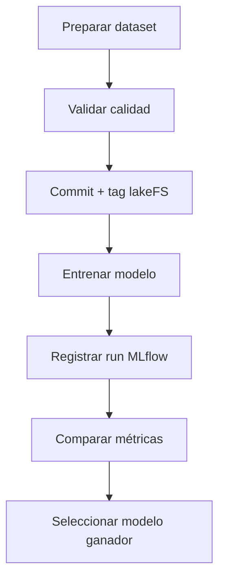
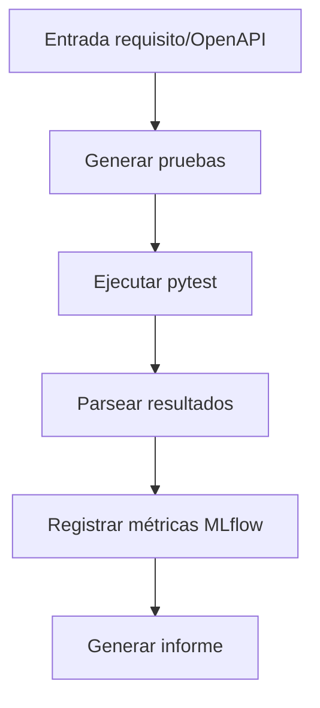

# Runbook MLOps

## 1. Objetivo

Definir cómo se registran, versionan y trazan los experimentos de modelos y las ejecuciones de QABot.

El objetivo es poder responder siempre a estas preguntas:

- Qué código generó el resultado.
- Qué dataset se usó.
- Qué versión del dataset se usó.
- Qué parámetros se aplicaron.
- Qué métricas se obtuvieron.
- Qué modelo o artefacto se generó.

## 2. Componentes

| Componente | Uso |
|---|---|
| MLflow | Registro de experimentos, métricas, parámetros, artefactos y modelos. |
| lakeFS | Versionado de datasets. |
| Git | Versionado de código. |
| notebooks | Documentación ejecutable de análisis y entrenamiento. |

## 3. MLflow

### 3.1 URL

```text
http://localhost:5000
```

### 3.2 Experimentos previstos

| Experimento | Descripción |
|---|---|
| `CasoD_UCI_Occupancy` | Modelos de clasificación de ocupación. |
| `CasoD_IAQ` | Evaluación del índice IAQ y reglas de alerta. |
| `QABot_TestGeneration` | Generación y ejecución de pruebas por agentes. |
| `MLOps_Validation` | Pruebas internas de trazabilidad. |

### 3.3 Campos obligatorios por run

Parámetros:

- `algorithm`
- `dataset_name`
- `dataset_version`
- `lakefs_repo`
- `lakefs_tag`
- `git_commit`
- `train_rows`
- `test_rows`
- `features`

Métricas para clasificación:

- `accuracy`
- `precision`
- `recall`
- `f1_score`
- `auc_roc`

Artefactos:

- Matriz de confusión.
- Curva ROC.
- Informe de clasificación.
- Modelo serializado.
- Fichero de configuración usado.

## 4. lakeFS

### 4.1 Repositorios previstos

| Repositorio | Contenido |
|---|---|
| `uci_occupancy` | Dataset UCI Occupancy original y procesado. |
| `ingauge` | Dataset In-Gauge / En-Gage si se usa como ampliación. |
| `qabot_examples` | OpenAPI, requisitos y golden set de QABot. |

### 4.2 Convención de tags

```text
<dataset>_<estado>_v<n>
```

Ejemplos:

```text
uci_occupancy_raw_v1
uci_occupancy_clean_v1
uci_occupancy_features_v1
qabot_golden_set_v1
```

### 4.3 Convención de commits lakeFS

Formato:

```text
<tipo>: <descripción breve>
```

Tipos:

- `raw`: carga de datos originales.
- `clean`: limpieza.
- `feature`: creación de variables.
- `split`: partición de entrenamiento/test.
- `fix`: corrección de datos.

Ejemplos:

```text
raw: add original UCI occupancy files
clean: remove duplicated timestamps and normalize column names
feature: add temporal features for occupancy model
```

## 5. Git

### 5.1 Ramas

| Rama | Uso |
|---|---|
| `main` | Versión estable. |
| `develop` | Integración de trabajo. |
| `feature/caso-d-models` | Modelos de ocupación. |
| `feature/mlops` | MLflow/lakeFS. |
| `feature/qabot-agents` | Agentes QABot. |
| `docs/final-delivery` | Documentación final. |

### 5.2 Commits

Formato:

```text
<tipo>: <descripción>
```

Tipos:

- `feat`
- `fix`
- `docs`
- `test`
- `refactor`
- `chore`

Ejemplos:

```text
feat: add random forest training pipeline
fix: validate humidity range in data quality checks
docs: complete mlflow runbook
```

## 6. Flujo de entrenamiento recomendado



## 7. Flujo QABot recomendado



Métricas QABot:

- `tests_generated`
- `tests_executable`
- `tests_passed`
- `tests_failed`
- `detected_defects`
- `generation_time_seconds`
- `execution_time_seconds`
- `valid_test_ratio`

## 8. Comandos útiles

Ver UI de MLflow:

```bash
open http://localhost:5000
```

Listar experimentos con Python:

```bash
python -c "import mlflow; print(mlflow.search_experiments())"
```

Ejecutar entrenamiento con tracking:

```bash
MLFLOW_TRACKING_URI=http://localhost:5000 python -m src.models.train_random_forest
```

## 9. Evidencias para la entrega

Capturas o referencias necesarias:

- Pantalla de MLflow con varios runs.
- Detalle de un run con métricas y artefactos.
- Vista de lakeFS con tags del dataset.
- Notebook con el `run_id` del modelo ganador.
- Reporte QABot registrado como artefacto.

## 10. Criterio de éxito

Un resultado solo se considera evaluable si puede trazarse hasta:

- Commit Git.
- Tag lakeFS.
- Run MLflow.
- Notebook o script que lo generó.
